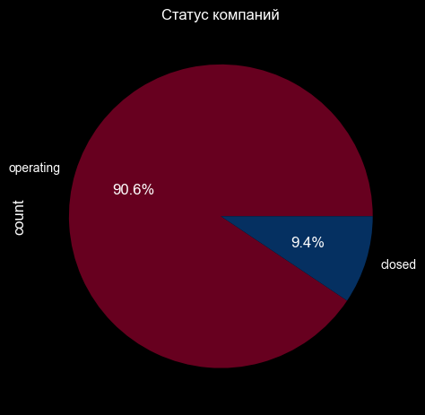
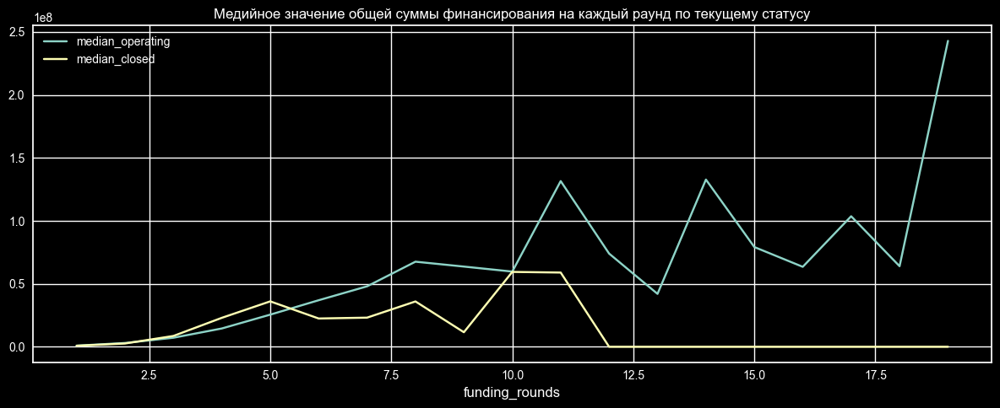
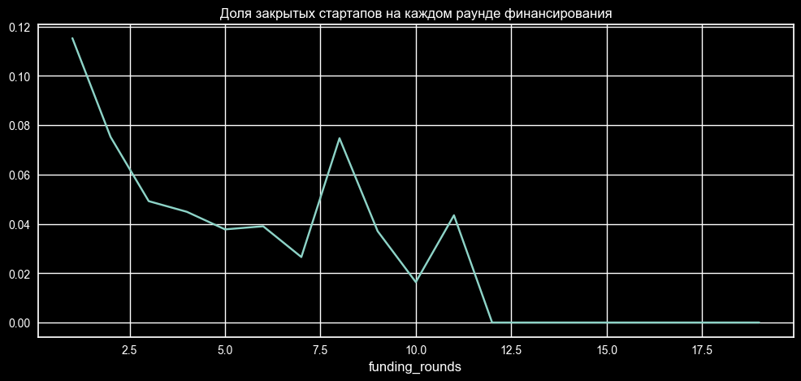
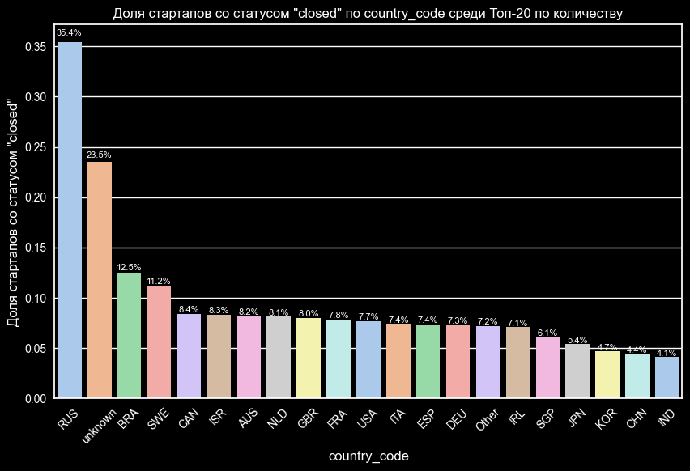
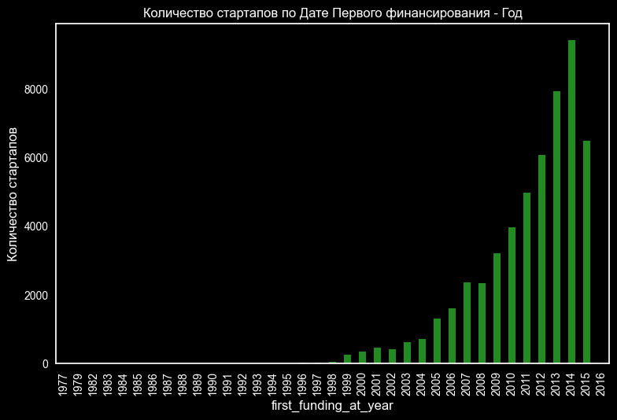
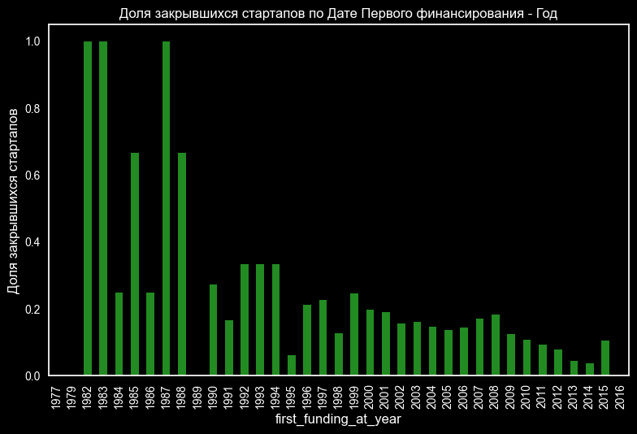
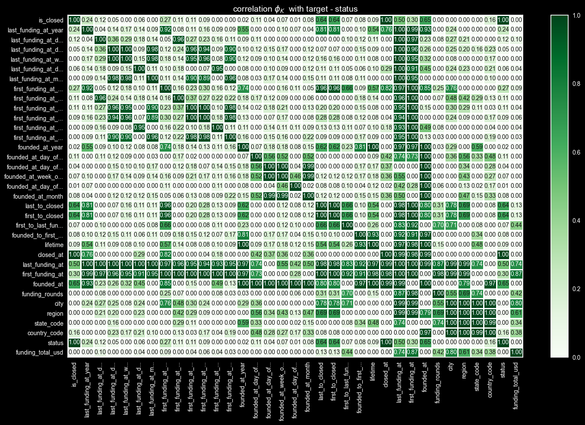
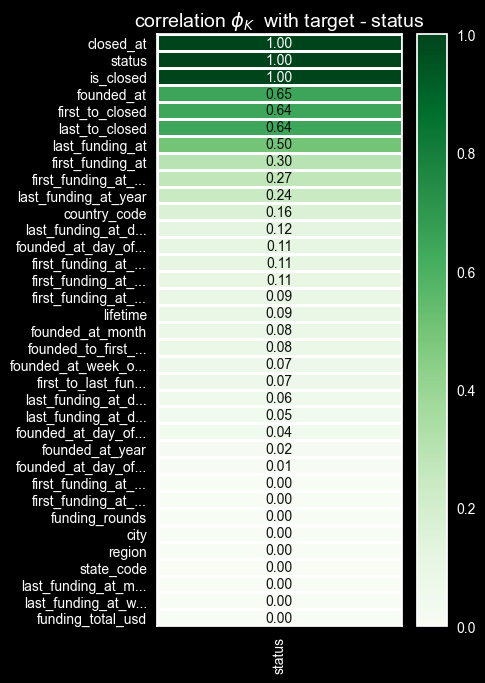
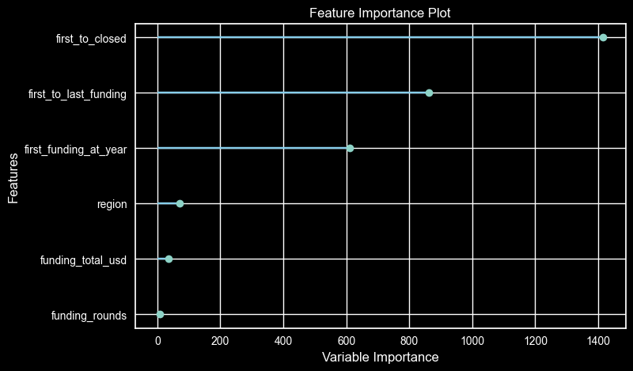

# Предсказание успешности стартапов.

Прогнозирование закрытия стартапов является актуальной задачей в современной экономике, где инновации и предпринимательство играют ключевую роль. Успех стартапа зависит от множества факторов, таких как финансирование, команда, продукт, рынок и внешние условия. Разработка эффективных моделей прогнозирования может помочь снизить риски инвестиций и повысить шансы на успех новых предприятий.

Целью данного исследования является построение модели машинного обучения, способной прогнозировать закрытие стартапов с высокой точностью. В рамках исследования будут идентифицированы ключевые факторы, влияющие на успех или провал стартапов, а также проанализирована эффективность модели на различных временных периодах и для разных категорий стартапов.

Результаты исследования могут быть использованы инвесторами для принятия более обоснованных решений о финансировании стартапов, а также предпринимателями для оценки рисков и повышения шансов на успех. В конечном итоге, это может способствовать развитию инновационной экосистемы за счёт снижения уровня неудачных проектов.

**Вопрос:**
- Прогнозирование закрытия стартапов является важной задачей для инвесторов, предпринимателей и исследователей.
- Существует множество факторов, влияющих на успех или провал стартапа, включая финансирование, команду, продукт, рынок и внешние условия.
- Разработка эффективных моделей прогнозирования может помочь снизить риски инвестиций и повысить шансы на успех новых предприятий.

**Цель исследования:**
- Построить модель машинного обучения, способную прогнозировать закрытие стартапов с высокой точностью.
- Идентифицировать ключевые факторы, влияющие на успех или провал стартапов.
- Проанализировать эффективность модели на различных временных периодах и для разных категорий стартапов.

**Бизнес-задача:**
- Помочь инвесторам принимать более обоснованные решения о финансировании стартапов.
- Предоставить предпринимателям инструменты для оценки рисков и повышения шансов на успех.
- Способствовать развитию инновационной экосистемы за счёт снижения уровня неудачных проектов.

**Описание исходных данных:**

Датасет состоит из двух файлов: тренировочный набор (около 53к записей) и тестовый набор (около 13к записей). Тренировочный набор содержит целевой признак status, указывающий на то, закрылся стартап или продолжает действовать. Временной период - '1970-01-01' по '2018-01-01'. Дата формирования выгрузки - '2018-01-01'

- kaggle_startups_train_01.csv - информация о (53 000) стартапах, которые будут использоваться в качестве обучающих данных.
- kaggle_startups_test_01.csv - информация о (13 000) стартапах, которые будут использоваться в качестве тестовых данных. Задача - предсказать значение 'status' для каждого стартапа из этого датасета.

Столбцы датасета:
- name - Название стартапа, идентификатор в тестовом наборе.
- category_list - Список категорий, к которым относится стартап
- funding_total_usd - Общая сумма финансирования в USD
- status - Статус стартапа (закрыт или действующий) - Целевой признак
- country_code - Код страны
- state_code - Код штата
- region - Регион
- city - Город
- funding_rounds - Количество раундов финансирования
- founded_at - Дата основания
- first_funding_at - Дата первого раунда финансирования
- last_funding_at - Дата последнего раунда финансирования
- closed_at - Дата закрытия стартапа (если применимо)

## Анализ данных

### Обзор данных и предобработка

Исходный набор данных содержит информацию о стартапах, включая название, категорию, общую сумму финансирования, статус (закрыт или действующий), местоположение (страна, штат, регион, город), количество раундов финансирования и даты (основания, первого и последнего финансирования, закрытия).

Первичный анализ данных выявил следующие особенности:

* **Пропуски:** Присутствуют во всех колонках, кроме статуса (целевой признак), даты последнего финансирования и даты основания. Большая часть пропусков в дате закрытия связана с действующими стартапами.
* **Выбросы:** Обнаружены некорректные даты в будущем, которые были скорректированы вручную.
* **Дисбаланс классов:** Наблюдается сильный дисбаланс между закрытыми и действующими стартапами (примерно 1 к 10).

- Рисунок 1. Распределение закрытых и функционирующих стартапов

### Исследовательский анализ данных (EDA)

**Числовые признаки:**

* **Количество раундов финансирования и общая сумма финансирования:** Анализ показал, что доля закрытых стартапов уменьшается с увеличением количества раундов финансирования. Общая сумма финансирования растёт с каждым раундом у рабочих проектов и перестаёт расти после 5-го раунда у закрытых проектов.
* **Размер финансирования:** Наблюдается большой разброс в данных, что требует применения методов масштабирования при обучении модели.

- Рисунок 2. Медийное значение общей суммы финансирования на каждый раунд по текущему статусу

- Рисунок 3. Доля закрытых стартапов на каждом раунде финансирования

**Категориальные признаки:**

* **Список категорий:** Анализ выявил категории с высокой и низкой долей закрытых стартапов, что указывает на важность этого признака для прогнозирования.
* **Страна, штат, регион, город:** Эти признаки также важны для обучения, но требуют фильтрации редких значений для повышения эффективности модели.

- Рисунок 4. Доля закрытых стартапов по году первого финансирования

**Признаки с датами:**

* **Обработка некорректных дат:** Даты в будущем были скорректированы вручную.
* **Пропуски в датах:** Пропуски в дате первого финансирования были заполнены с помощью интерполяции, а пропуски в дате закрытия - датой выгрузки данных.
* **Генерация новых признаков:** Были созданы признаки, отражающие разницу между различными датами, например, срок жизни стартапа (lifetime).

- Рисунок 5. Доля закрытых стартапов по году первого финансирования

- Рисунок 6. Доля закрытых стартапов по году первого финансирования

**Анализ корреляций:**

* Выявлена сильная корреляция между признаками даты и географии, а также между признаками и целевой переменной.

- Рисунок 7. Матрица корреляций (все признаки).

- Рисунок 8. Матрица корреляций (только с таргетом).

* Корреляция с закодированным списком категорий

<table border="1" class="dataframe">
  <thead>
    <tr style="text-align: right;">
      <th></th>
      <th>status</th>
    </tr>
  </thead>
  <tbody>
    <tr>
      <th>category_list_encoded</th>
      <td>0.718351</td>
    </tr>
  </tbody>
</table>

## Методология

Для подготовки данных к обучению модели была проведена предобработка, включающая:

* **Обработку пропусков:** Пропуски в числовых признаках были заполнены средними значениями, а в категориальных - специальным значением "unknown".
* **Кодирование категориальных признаков:** Для кодирования категориальных признаков, таких как список категорий и регион, был использован метод TargetEncoder, учитывающий связь признака с целевой переменной.
* **Масштабирование числовых признаков:** Учитывая большой разброс в данных, вероятно, было применено масштабирование для нормализации числовых признаков 

В качестве основной модели был выбран LightGBM из-за его эффективности и скорости работы с большими наборами данных. Гиперпараметры модели были оптимизированы с помощью встроенной оптимизации в Pycaret. Для оценки обобщающей способности модели была использована кросс-валидация.

В качестве основной метрики оценки эффективности модели была выбрана F1-мера, учитывающая баланс между точностью и полнотой. Также были проанализированы точность и полнота для более полного анализа модели.

## Результаты

### Анализ важности признаков

Анализ важности признаков показал, что наиболее сильное влияние на прогнозирование закрытия стартапов оказывают следующие факторы:

* **Количество дней между первым раундом финансирования и датой получения последней информации (first_to_closed):** Этот признак имеет наибольшую важность, что указывает на значимость устойчивого финансирования и продолжительности существования стартапа для его успеха.
* **Количество дней между первым и последним раундом финансирования (first_to_last_funding):** Этот признак отражает темпы развития стартапа и может указывать на важность своевременного привлечения инвестиций.
* **Год первого финансирования (first_funding_at_year):** Этот признак может отражать влияние экономических циклов или технологических трендов на успех стартапов.
* **Регион (region):** Географическое положение стартапа может играть роль из-за различий в инвестиционном климате, доступности ресурсов и уровне конкуренции.

- Рисунок 9. Важность признаков.

### Эффективность модели на разных временных периодах

Модель была протестирована на данных из разных временных периодов, чтобы оценить её стабильность и надежность. Результаты показали, что F1-мера оставалась высокой на всех временных периодах, что свидетельствует о хорошей обобщающей способности модели.

### Эффективность модели для различных категорий lifetime

Особое внимание было уделено анализу эффективности модели для стартапов с разным сроком жизни (lifetime), где lifetime определяется как количество дней между первым раундом финансирования и датой получения последней информации. Модель показала высокую эффективность для стартапов с lifetime более 2 лет, достигнув F1-меры 0.9845. Анализ выявил что в предоставленных данных все стартапы со сроком жизни меньше 2-х лет являются закрытыми. Это может говорить о необходимости получения дополнительных данных для стартапов со сроком жизни меньше 2-х лет.

- Разделение выборок по lifetime

    - Разделение выборок по first_to_closed

        - Размер выборок:
            - Меньше 1 года: 65
            - От 1-го года до 2-х: 3950
            - От 2-х лет до 3-х: 6029
            - От 3-х лет до 4-х: 9028
            - От 4-х до 5: 7725
            - Больше 5 лет: 26082

        - Доля закрытых стартапов:
            - Меньше 1 года: 1.0
            - От 1-го года до 2-х: 1.0
            - От 2-х лет до 3-х: 0.06
            - От 3-х лет до 4-х: 0.025
            - От 4-х до 5: 0.018
            - Больше 5 лет: 0.008

### Построение модели предсказания стартапов с сроком жизни больше 2-х лет 

`В предоставленном наборе данных все стартапы с временем жизни менее 2-х лет являются закрытыми.` Для повышения точности модели, было принято решение исключить эти данные из анализа. Для повышения точности модели, было принято решение исключить эти данные из анализа. Следовательно, бизнес-задача формулируется следующим образом: `"Построение модели предсказания закрытия стартапов, существующих более 2-х лет."`
Данная модель позволит инвесторам и предпринимателям принимать более обоснованные решения, оценивая риски и потенциал долгосрочного развития стартапов.
* За lifetime в данном случае принимается количество дней между датой первого финансирования и датой выгрузки (first_to_closed).

* После удаления данных о стартапах с сроком жизни меньше 2-х лет:

    - Размер выборки 48864
    - Доля в % от исходных данных: 92.41
    - `Доля закрытых стартапов (баланс классов): 0.0194 (1.94 %)`

### Описание финальной модели

Финальная модель представляет собой `LightGBM` с отобранными признаками (`funding_total_usd, funding_rounds, first_to_closed, first_to_last_funding, first_funding_at_year, region`) и оптимизированными гиперпараметрами. `Pipeline` модели включает обработку пропусков, кодирование категориальных признаков с помощью TargetEncoder и обучение модели LightGBM.

## Выводы

В данном исследовании была разработана модель машинного обучения на основе LightGBM для прогнозирования закрытия стартапов. Модель продемонстрировала высокую эффективность, особенно для стартапов с lifetime более 2 лет, достигнув `F1-меры 0.9845`.

Анализ важности признаков выявил, что ключевыми факторами, влияющими на успех стартапа, являются устойчивое финансирование, темпы развития, год первого финансирования и регион. Модель оставалась стабильной и надежной на разных временных периодах, что подтверждает её обобщающую способность.

Результаты исследования могут быть использованы инвесторами и предпринимателями для оценки рисков и принятия обоснованных решений. Фокус на стартапах с lifetime более 2 лет делает модель особенно ценной для анализа долгосрочного потенциала.

В качестве направлений для дальнейшей работы можно рассмотреть:
- Использование дополнительных данных, особенно добавление последних актуальных данных (недостающих данных за 2016-2017 год, а так же новых данных после 2018 г.)
- Исследование других моделей машинного обучения и методов ансамблирования.
- Преобразование датасета с дублированием строк долгоживущих стартапов с указанием разного lifetime.
- Рассмотреть задачу как задачу временных рядов ("Сколько проживёт стартап?","Закроется-ли стартап в течении следующих 3-х лет?")